# System Flow Chart

> Memory Wedding — 시스템 흐름도 및 프로세스 설계

## 문서 정보

| 항목 | 내용 |
|------|------|
| 버전 | 1.0.0 |
| 작성일 | 2026-09-10 |
| 상태 | Draft |
| 참조 | `docs/requirements-spec.md`, `docs/ui-ux-design.md`, `docs/erd.md` |

---

## 1. 시스템 아키텍처 개요

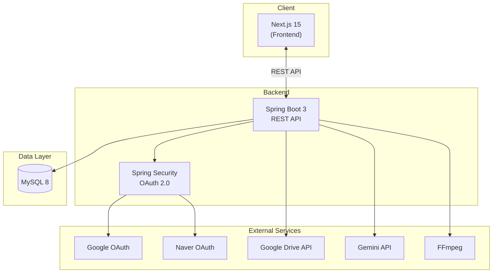

---

## 2. 사용자 Role별 접근 흐름

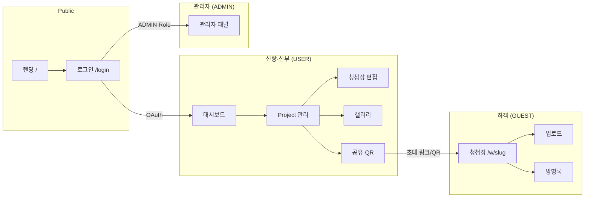

---

## 3. OAuth 로그인 흐름

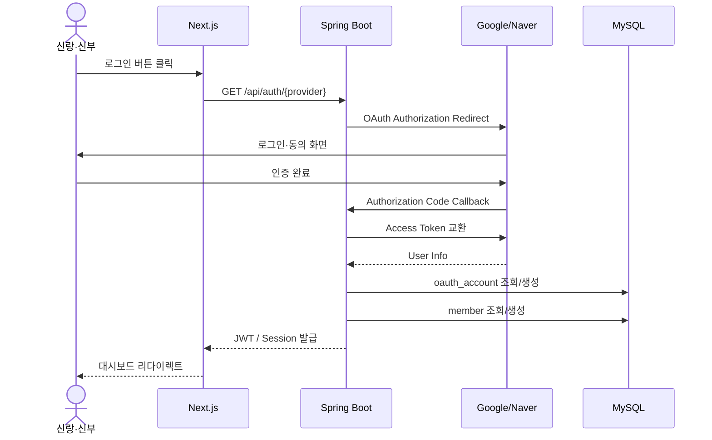

---

## 4. Wedding Project 생성 흐름

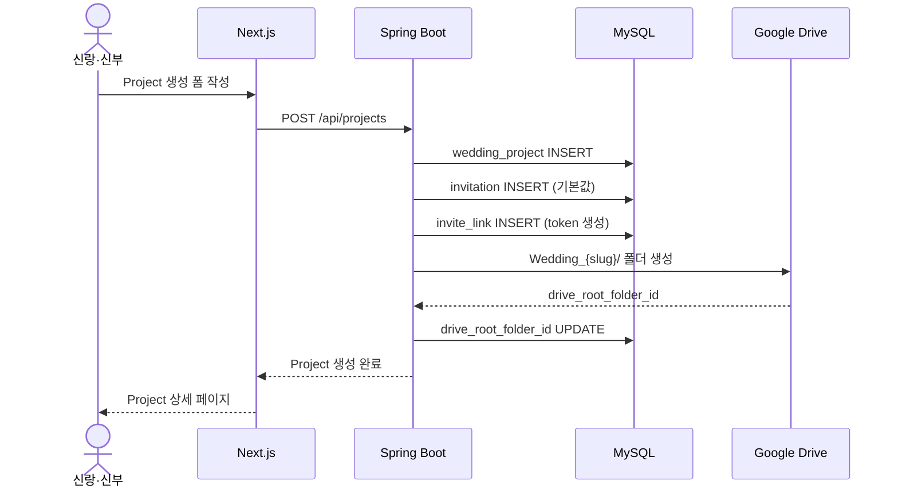

---

## 5. 하객 사진·영상 업로드 흐름

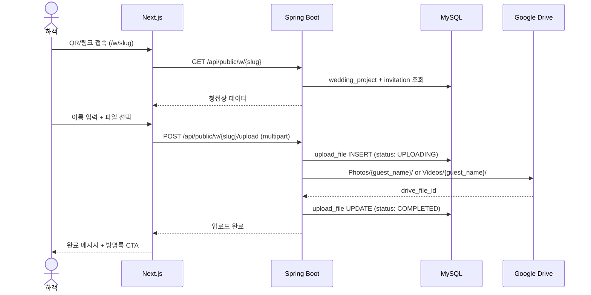

---

## 6. 방명록 작성 흐름

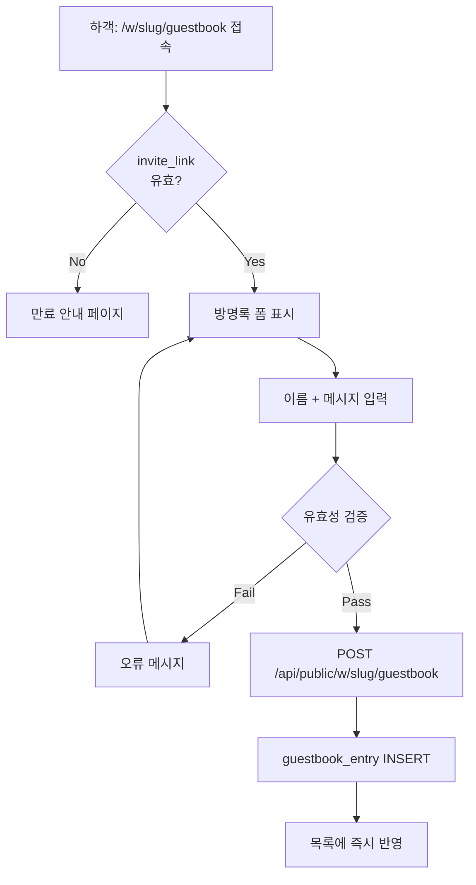

---

## 7. 청첩장 편집·공개 흐름

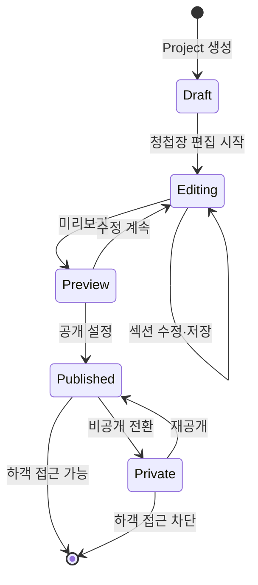

---

## 8. Google Drive 저장 흐름

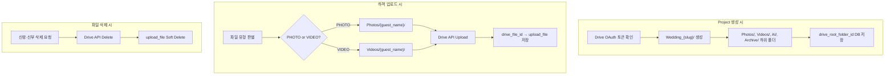

---

## 9. AI 분석 흐름 (MVP 이후)

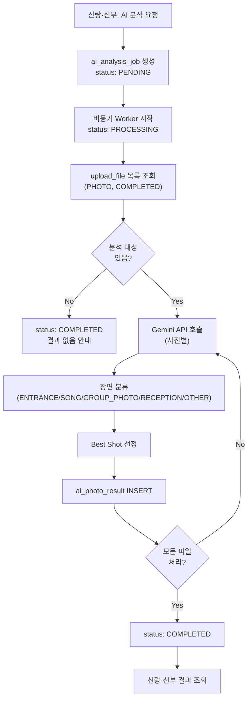

---

## 10. AI 하이라이트 영상 생성 흐름 (MVP 이후)

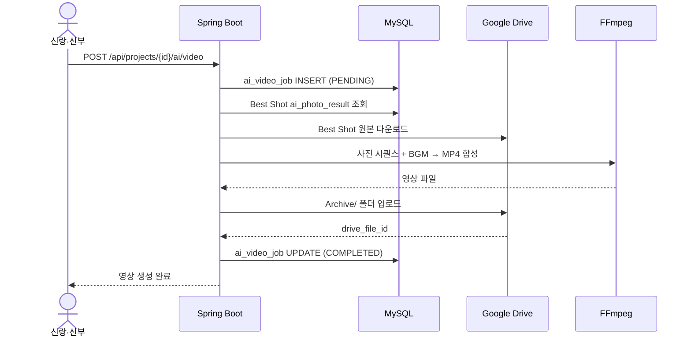

---

## 11. 관리자 모니터링 흐름

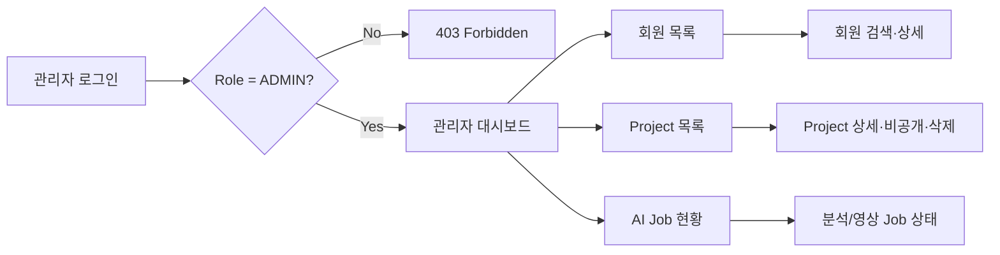

---

## 12. API 요청 처리 공통 흐름

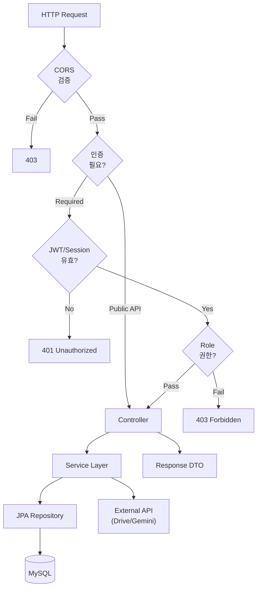

---

## 13. 배포 흐름 (목표)

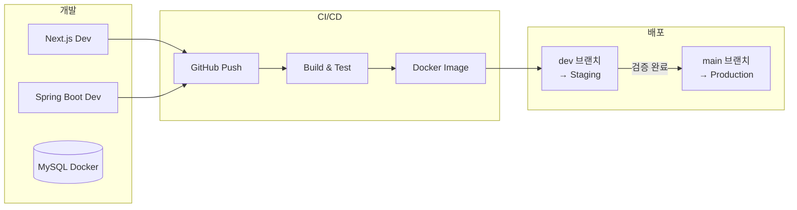

---

## 14. MVP vs 확장 Flow 범위

| Flow | MVP | Phase 2 |
|------|-----|---------|
| OAuth 로그인 | ✅ | |
| Project CRUD | ✅ | |
| 청첩장 편집·공개 | ✅ | |
| 하객 업로드 | ✅ | |
| Drive 저장 | ✅ | |
| 방명록 | ✅ | |
| 관리자 기본 | ✅ | |
| AI 장면 분류 | | ✅ |
| Best Shot | | ✅ |
| FFmpeg 영상 | | ✅ |
| CI/CD 배포 | | ✅ |

---

## 15. FR 매핑

| Flow | 연관 FR |
|------|---------|
| §3 OAuth 로그인 | FR-MEM-001, 002 |
| §4 Project 생성 | FR-PRJ-001, FR-STR-002 |
| §5 하객 업로드 | FR-GST-002~006, FR-STR-001 |
| §6 방명록 | FR-GBK-001, 002 |
| §7 청첩장 공개 | FR-INV-003, 004 |
| §8 Drive 저장 | FR-STR-001~004 |
| §9 AI 분석 | FR-AI-001~004 |
| §10 AI 영상 | FR-AI-005, 006 |
| §11 관리자 | FR-ADM-001~006 |

---

## 변경 이력

| 버전 | 일자 | 변경 내용 | 작성자 |
|------|------|-----------|--------|
| 1.0.0 | 2026-09-10 | 초안 작성 | - |
